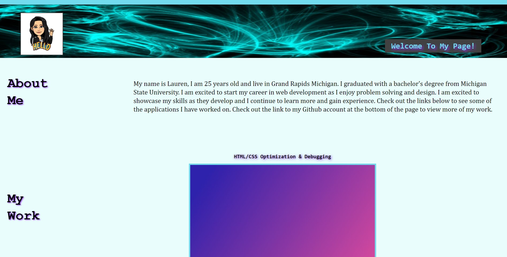
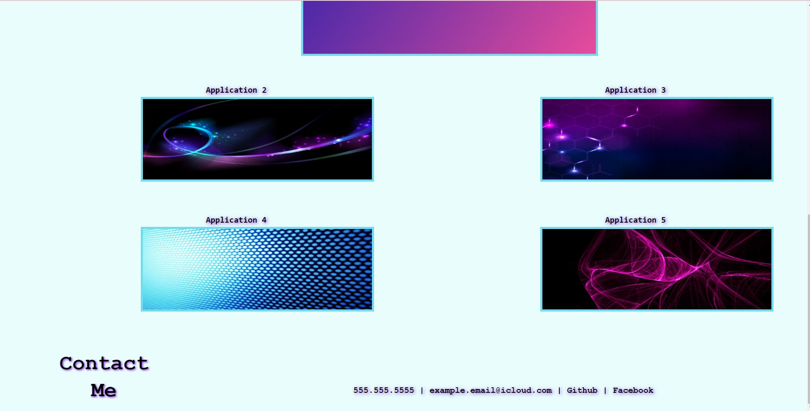

# Name
My personal portfolio

# Description

This project is a personal portfolio website that showcases my skills as a web developer.

The site will be updated as my skills develop and I have more projects to display.

Clicking on the images will take you to each site that I have worked on.

It also includes all my contact information.

The site is optimized to fit all screen sizes and includes multiple advanced CSS styling tools.

semantic structure is used so the code is readable and organized.

# Usage

Click here to see the live URL:

https://laurencvengros.github.io/my-portfolio/

Click here for a screenshot of the  position: 

